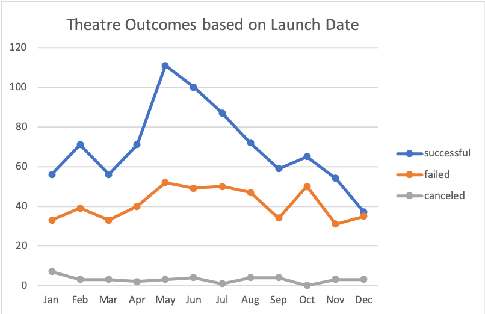
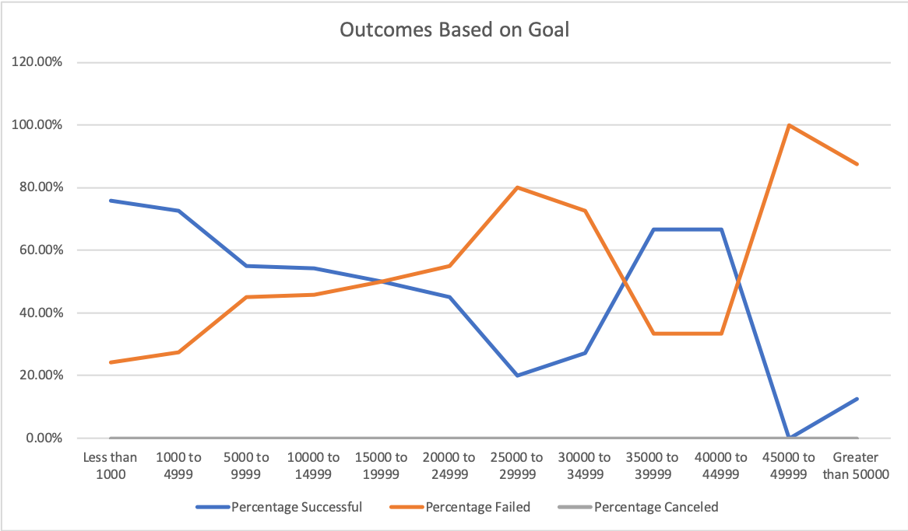

# Kickstarter-analysis
Performing analysis on Kickstarted data to uncover trends

## Overview of Project
---
Louise wanted to know how different campaigns fared in relation to their launch dates and their funding goals
### Purpose:
- Finding *theatre outcomes* by **launch date** 
- Finding outcomes **based on goals** for the subcategory *plays*

## Analysis and Challenges 
---

### Analysis based on Theatre Outcomes by Launch date:

</img>

- For *succesful outcomes* in Theatre Category:
  - There was a steap increase in the month of May with value:111 
  - Followed by steap decrease with the value of 59 in the month of September 
  - The lowest would be seen in the month of December with the value of 37

- For *Failed Outcomes* in Theatre Category:
  - Failed outcomes remained less than value 60, monthly trend over the years

- For *Canceled Outcomes* in Theatre Category:
  - It remained steady, less than 20 

### Analysis based on Goals for the subcategory plays 

 </img>

- For *successful outcomes* in Plays category:
  - Overall sucessful percentage was less than 80%
  - Decrease to 20 percent for Goals range from `25000-29999`
  - Steap fall in the range of `45000-49999`, where the percentage was 0 percent

- For *Failed Outcomes* in Plays category:
  - It can be seen that failed outcomes is the opposite compared to successful outcomes
  - As the successful percentage was decreasing, failed outcomes wer increasing 
  - Failed percentage reaches to 100 percent, in the range of `45000-49999`

- For *Canceled Outsomes* in Plays category:
  - Percentage canceled for the range of goals was zero 

### Challenges and Diffilculties encountered:
- Converting Unix Timestamps to readable format
- Placing the appropriate pivot table fields in columns,rows and values
- COUNTIFS() function

## Results
---
- What are two conclusions you can draw about the Outcomes based on Launch Date?
### The two conclusions are:
1. Steap increase from March to May can be viewed for the successful outcomes and steap fall is also observed from May to September. Bringing it down the value to 35 in the month of December.
2. Failed outcomes increased in the month of May with the value of 52, which was comparatively high.

- What can you conclude about the Outcomes based on Goals?
### Outcomes based on Goals:
From the line graph it can be concluded that Percentage failed and percenage successful were the exact opposite of one another.   Where percentage successful was decreasing with the goal range, percentage failed was increasing.   `25000 to 29999` showed decrease for successful and increase for Failed outcomes.  
In addition,`45000 to 49999` displayed steap decrease for sucessful and steap increase for failed outcomes

- What are some limitations of this dataset?
### Limitations:
 - Date and Year column could have been provided 

- What are some other possible tables and/or graphs that we could create?
### Other Possibilities:
 - Outcomes based on Pledged 
 - Outcomes based on deadlines for different categories 

